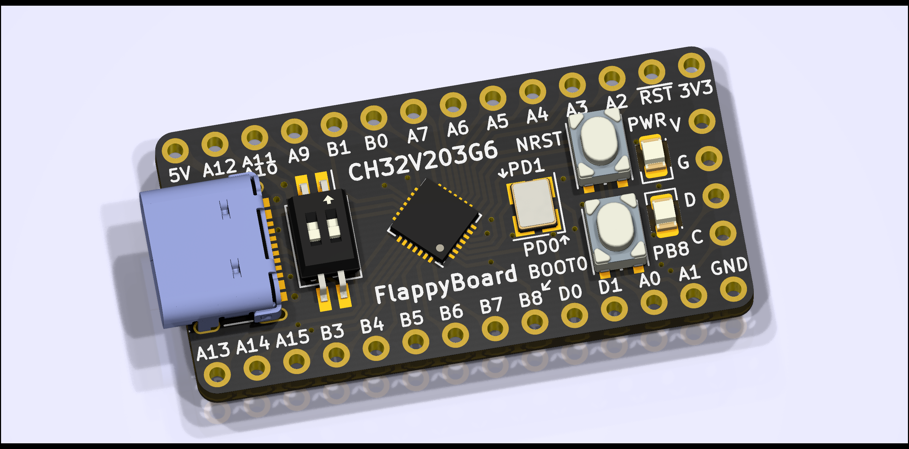

中文 | [English](README.md)

# FlappyBoard

## 项目简介

CH32V203G6的最小系统板，目标是极简、易用、低成本。

## 3D渲染图

## 许可证

CERN-OHL-P

## EDA

KiCad 6.0.6

## 使用方法

### 下载程序

推荐使用[WCHISPTool](https://www.wch.cn/downloads/WCHISPTool_Setup_exe.html)的USB下载功能，简单易用。当然串口下载和调试口下载也是可行的。

WCHISPTool需要选择正确的单片机型号（CH32V203）才能烧录。烧录时需确保拨码开关的两个信号都拨到ON，并且按住BOOT0按钮上电。顺利的话应该可以在WCHISPTool中识别到单片机。

### LED和按钮

板子上有两个LED，其中*PWR*对应电源LED（3.3V供电），*PB8*对应用户自定义LED。

板子上有两个按钮，其中*NRST*对应系统复位，*BOOT0*对应启动模式（默认运行Flash的用户程序，按下时运行ROM的启动程序）。

> 注：在CH32V203G6中，*PB8*和*BOOT0*复用了引脚。具体的行为如下：
>
> * 在启动过程中，单片机通过该引脚获取*BOOT0*状态，此时该引脚为输入引脚。在按下*BOOT0*的同时，*PB8*对应的LED同时会被点亮以提示用户。
> * 在进入到用户程序之后，单片机的*PB8*引脚可用，但仅能用于输出，输入是无效值。此时，*PB8*对应的LED可由用户程序控制，但*BOOT0*对应的按钮状态无法被获取。

### 外部时钟输入

CH32V203G6可以接受有源晶振和无源晶体，频率在3-25MHz之间即可。

板子上自带了外置晶振和负载电容的焊盘，但默认不焊接，原因是在一般应用中使用内置晶振（HSI）即可达到精度要求。

## 原理图

见[FlappyBoard Schematic](schematics/FlappyBoard.pdf)。

## BOM

见[FlappyBoard BOM](https://metro94.github.io/FlappyBoard/bom.html)。

## 测试程序

都在[software/examples](software/examples)文件夹中，按需使用。

